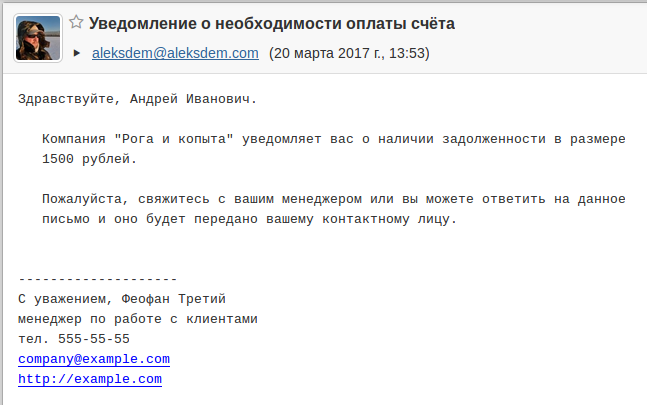

ClientNotification - программа для рассылки уведомлений клиентам о необходимости оплаты.

Данные берутся из выгруженного файла в следующем формате:

```
почта:обращение(имя клиента, название компании):сумма задолженности
```

Все эти данные расположены в файле clients.txt. В конце файла должна быть пустая строка, иначе
последнее значение не будет отправлено.


Настройки почты, а так же текст письма задаётся в файле mailsettings.xml





